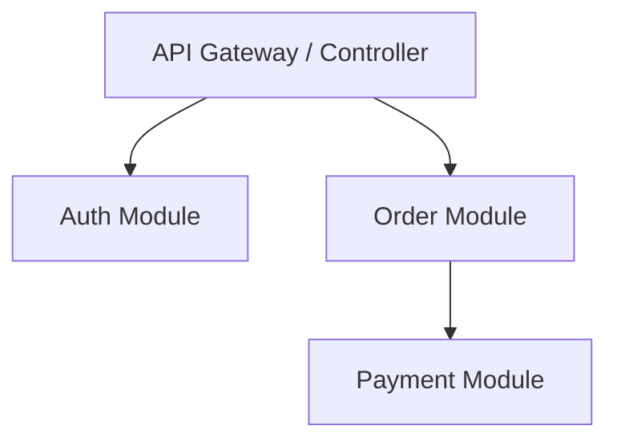

# 系统领域模型与模块边界字典 (Domain Map)

## 1. 模块通信铁律
- 本项目采用**高内聚模块化架构**。
- 模块 A 调用模块 B 时，**只能**通过模块 B 暴露的 `index.ts`（或公开接口层）进行调用，严禁直接引用模块 B 的 `internal/`、`services/` 或 `repositories/` 目录。

## 2. 核心数据流向

```mermaid
graph TD
    Client[API Gateway / Controller] --> Auth[Auth Module]
    Client --> Order[Order Module]
    Order --> Payment[Payment Module]
```
